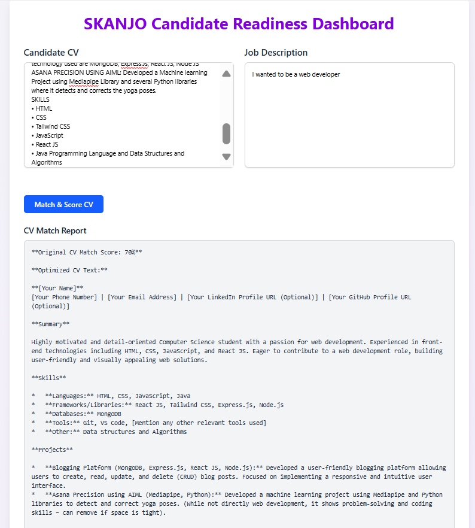

# 🧠 Candidate Readiness Dashboard

A React + Vite web application for analyzing candidate CVs against job descriptions using Gemini AI.  
It provides a detailed match score and skill gap analysis with a clean, responsive UI.

---

## 🚀 Live Demo

👉 [View Deployed App on Netlify](https://candidate-readiness-dashboard.netlify.app/)

---

## 🛠️ Local Setup Instructions

```bash
# 1. Clone the repository
git clone https://github.com/CHANDANA-B-R/candidate-readiness-dashboard.git

# 2. Navigate into the project
cd candidate-readiness-dashboard

# 3. Install dependencies
npm install

# 4. Create a .env file
touch .env

Inside .env, add:

VITE_GEMINI_API_KEY=your_actual_api_key_here

Then:
# 5. Start the development server
npm run dev

The app will run at: http://localhost:5173

💡 Usage Instructions
Upload a CV and Job Description.

Click "Analyze".

The Gemini AI API will:

Compare both inputs

Return a match score

Show skill gaps and recommendations

View results in the Score Display and Skill Gaps sections.

🔧 Technical Decisions & Challenges
🧱 Project Structure
Built with React + Vite for faster dev & build time

Reusable components: CVInput, JDInput, ScoreDisplay, SkillGaps

Utility folder handles Gemini API integration

🤖 AI Integration
Used Google Gemini API via geminiAPI.js

Cleaned and formatted response using string parsing techniques

🎨 TailwindCSS Usage
Responsive layout with Tailwind (flex, grid, min-h-screen, etc.)

Used utility-first classes for a consistent look

## 📸 Screenshot



